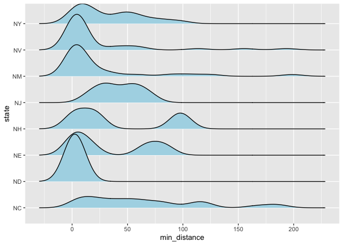

Lab 05 - La Quinta is Spanish for next to Denny’s, Pt. 2
================
Thomas Huang
2026-02-06

### Load packages and data

``` r
library(tidyverse) 
library(dsbox) 
library(ggridges)
```

``` r
states <- read_csv("data/states.csv")
data(dennys, package = "dsbox")
data(laquinta, package = "dsbox")
```

### Exercise 1

There are three Denny’s and two La Quinta in Alaska.

``` r
dn_ak <- dennys %>%
  filter(state == "AK")
nrow(dn_ak)
```

    ## [1] 3

``` r
lq_ak <- laquinta %>%
  filter(state == "AK")
nrow(lq_ak)
```

    ## [1] 2

### Exercise 2

There are three Denny’s and two La Quinta in Alaska. Each Denny’s
corresponds to two La Quinta. Therefore, there should be $$3\times2=6$$
pairs.

### Exercise 3

``` r
dn_lq_ak <- full_join(dn_ak, lq_ak,
  by = "state"
)
```

    ## Warning in full_join(dn_ak, lq_ak, by = "state"): Detected an unexpected many-to-many relationship between `x` and `y`.
    ## ℹ Row 1 of `x` matches multiple rows in `y`.
    ## ℹ Row 1 of `y` matches multiple rows in `x`.
    ## ℹ If a many-to-many relationship is expected, set `relationship =
    ##   "many-to-many"` to silence this warning.

``` r
dn_lq_ak
```

    ## # A tibble: 6 × 11
    ##   address.x     city.x state zip.x longitude.x latitude.x address.y city.y zip.y
    ##   <chr>         <chr>  <chr> <chr>       <dbl>      <dbl> <chr>     <chr>  <chr>
    ## 1 2900 Denali   Ancho… AK    99503       -150.       61.2 3501 Min… "\nAn… 99503
    ## 2 2900 Denali   Ancho… AK    99503       -150.       61.2 4920 Dal… "\nFa… 99709
    ## 3 3850 Debarr … Ancho… AK    99508       -150.       61.2 3501 Min… "\nAn… 99503
    ## 4 3850 Debarr … Ancho… AK    99508       -150.       61.2 4920 Dal… "\nFa… 99709
    ## 5 1929 Airport… Fairb… AK    99701       -148.       64.8 3501 Min… "\nAn… 99503
    ## 6 1929 Airport… Fairb… AK    99701       -148.       64.8 4920 Dal… "\nFa… 99709
    ## # ℹ 2 more variables: longitude.y <dbl>, latitude.y <dbl>

### Exercise 4

There are six observations in this data frame. The variable are street
address, city, state, zip code, longitude, and latitude of each Denny’s
and La Quinta.

``` r
glimpse(dn_lq_ak)
```

    ## Rows: 6
    ## Columns: 11
    ## $ address.x   <chr> "2900 Denali", "2900 Denali", "3850 Debarr Road", "3850 De…
    ## $ city.x      <chr> "Anchorage", "Anchorage", "Anchorage", "Anchorage", "Fairb…
    ## $ state       <chr> "AK", "AK", "AK", "AK", "AK", "AK"
    ## $ zip.x       <chr> "99503", "99503", "99508", "99508", "99701", "99701"
    ## $ longitude.x <dbl> -149.8767, -149.8767, -149.8090, -149.8090, -147.7600, -14…
    ## $ latitude.x  <dbl> 61.1953, 61.1953, 61.2097, 61.2097, 64.8366, 64.8366
    ## $ address.y   <chr> "3501 Minnesota Dr.", "4920 Dale Rd", "3501 Minnesota Dr."…
    ## $ city.y      <chr> "\nAnchorage", "\nFairbanks", "\nAnchorage", "\nFairbanks"…
    ## $ zip.y       <chr> "99503", "99709", "99503", "99709", "99503", "99709"
    ## $ longitude.y <dbl> -149.9119, -147.8660, -149.9119, -147.8660, -149.9119, -14…
    ## $ latitude.y  <dbl> 61.18843, 64.82426, 61.18843, 64.82426, 61.18843, 64.82426

### Exercise 5

dplyr::mutate(new_var = …) can be used to create a new variable.

``` r
# Define a cool function that calculates the distance between any two points on the earth.
haversine <- function(long1, lat1, long2, lat2, round = 3) {
  # convert to radians
  long1 <- long1 * pi / 180
  lat1 <- lat1 * pi / 180
  long2 <- long2 * pi / 180
  lat2 <- lat2 * pi / 180

  R <- 6371 # Earth mean radius in km

  a <- sin((lat2 - lat1) / 2)^2 + cos(lat1) * cos(lat2) * sin((long2 - long1) / 2)^2
  d <- R * 2 * asin(sqrt(a))

  return(round(d, round)) # distance in km
}
```

### Exercise 6

``` r
dn_lq_ak <- dn_lq_ak %>% 
  dplyr::mutate(
    distance = haversine(longitude.x, latitude.x, longitude.y, latitude.y)
  )

glimpse(dn_lq_ak)
```

    ## Rows: 6
    ## Columns: 12
    ## $ address.x   <chr> "2900 Denali", "2900 Denali", "3850 Debarr Road", "3850 De…
    ## $ city.x      <chr> "Anchorage", "Anchorage", "Anchorage", "Anchorage", "Fairb…
    ## $ state       <chr> "AK", "AK", "AK", "AK", "AK", "AK"
    ## $ zip.x       <chr> "99503", "99503", "99508", "99508", "99701", "99701"
    ## $ longitude.x <dbl> -149.8767, -149.8767, -149.8090, -149.8090, -147.7600, -14…
    ## $ latitude.x  <dbl> 61.1953, 61.1953, 61.2097, 61.2097, 64.8366, 64.8366
    ## $ address.y   <chr> "3501 Minnesota Dr.", "4920 Dale Rd", "3501 Minnesota Dr."…
    ## $ city.y      <chr> "\nAnchorage", "\nFairbanks", "\nAnchorage", "\nFairbanks"…
    ## $ zip.y       <chr> "99503", "99709", "99503", "99709", "99503", "99709"
    ## $ longitude.y <dbl> -149.9119, -147.8660, -149.9119, -147.8660, -149.9119, -14…
    ## $ latitude.y  <dbl> 61.18843, 64.82426, 61.18843, 64.82426, 61.18843, 64.82426
    ## $ distance    <dbl> 2.035, 416.031, 5.998, 413.653, 419.879, 5.197

### Exercise 7

``` r
dn_lq_ak <- dn_lq_ak %>% 
  group_by(address.x) %>% 
  mutate(min_distance = min(distance))
```

### Exercise 8

``` r
# Summary stats
psych::describe(dn_lq_ak$min_distance)
```

    ##    vars n mean   sd median trimmed  mad  min max range  skew kurtosis   se
    ## X1    1 6 4.41 1.87    5.2    4.41 1.19 2.04   6  3.96 -0.45    -1.96 0.77

``` r
ggplot(data = dn_lq_ak, aes(x = min_distance)) +
  geom_histogram()
```

    ## `stat_bin()` using `bins = 30`. Pick better value `binwidth`.

<!-- -->

### Exercise 9

``` r
state_function <- function(state_abbr){
  dn_state <- dennys %>%
  filter(state == state_abbr)

  lq_state <- laquinta %>%
  filter(state == state_abbr)
  
  dn_lq_state <- full_join(dn_state, lq_state,
    by = "state"
  ) %>% 
    dplyr::mutate(
      distance = haversine(longitude.x, latitude.x, longitude.y, latitude.y)
    ) %>% 
    group_by(address.x) %>% 
    mutate(min_distance = min(distance))
  
  psych::describe(dn_lq_state$min_distance)
  ggplot(data = dn_lq_state, aes(x = min_distance)) +
    geom_density()
}
```

``` r
state_function("NC")
```

    ## Warning in full_join(dn_state, lq_state, by = "state"): Detected an unexpected many-to-many relationship between `x` and `y`.
    ## ℹ Row 1 of `x` matches multiple rows in `y`.
    ## ℹ Row 1 of `y` matches multiple rows in `x`.
    ## ℹ If a many-to-many relationship is expected, set `relationship =
    ##   "many-to-many"` to silence this warning.

<!-- -->

### Exercise 10

``` r
state_function("TX")
```

    ## Warning in full_join(dn_state, lq_state, by = "state"): Detected an unexpected many-to-many relationship between `x` and `y`.
    ## ℹ Row 1 of `x` matches multiple rows in `y`.
    ## ℹ Row 1 of `y` matches multiple rows in `x`.
    ## ℹ If a many-to-many relationship is expected, set `relationship =
    ##   "many-to-many"` to silence this warning.

<!-- -->

### Exercise 11

I chose New York for this exercise.

``` r
state_function("NY")
```

    ## Warning in full_join(dn_state, lq_state, by = "state"): Detected an unexpected many-to-many relationship between `x` and `y`.
    ## ℹ Row 1 of `x` matches multiple rows in `y`.
    ## ℹ Row 1 of `y` matches multiple rows in `x`.
    ## ℹ If a many-to-many relationship is expected, set `relationship =
    ##   "many-to-many"` to silence this warning.

<!-- -->

### Exercise 12

I think the joke is mostly true. It’s easy to find a La Quinta close to
a Denny’s.

### Exercise 13

The distribution of minimum distance varies by state. Such distributions
in Nevada, New Mexico, and North Dakota is approximately normal. But
such distributions follow a bi-modal distribution in states like New
York, New Hampshire, and Nebreska. It is possible that there are two or
more metropolitan areas in these states.

``` r
# Create an empty data frame
df <- data.frame(
  state = character(),
  min_distance = numeric()
)

# Create a list of states
states <- list("NY", "NV", "NM", "NJ", "NH", "NE", "ND", "NC")

# Define another state function
state_function_2 <- function(state_abbr){
  
  dn_state <- dennys %>%
  filter(state == state_abbr) 

  lq_state <- laquinta %>%
  filter(state == state_abbr)
  
  dn_lq_state <- full_join(dn_state, lq_state,
    by = "state"
  ) %>% 
    dplyr::mutate(
      distance = haversine(longitude.x, latitude.x, longitude.y, latitude.y)
    ) %>% 
    group_by(address.x) %>% 
    mutate(min_distance = min(distance)) %>% 
    dplyr::select(state, min_distance)
  
  return(dn_lq_state)

}

# Loop over to calculate the min distances in the list of states
for (state in states){
  dn_lq_state <- state_function_2(state)
  df <- rbind(df, dn_lq_state)
}
```

    ## Warning in full_join(dn_state, lq_state, by = "state"): Detected an unexpected many-to-many relationship between `x` and `y`.
    ## ℹ Row 1 of `x` matches multiple rows in `y`.
    ## ℹ Row 1 of `y` matches multiple rows in `x`.
    ## ℹ If a many-to-many relationship is expected, set `relationship =
    ##   "many-to-many"` to silence this warning.

    ## Adding missing grouping variables: `address.x`

    ## Warning in full_join(dn_state, lq_state, by = "state"): Detected an unexpected many-to-many relationship between `x` and `y`.
    ## ℹ Row 1 of `x` matches multiple rows in `y`.
    ## ℹ Row 1 of `y` matches multiple rows in `x`.
    ## ℹ If a many-to-many relationship is expected, set `relationship =
    ##   "many-to-many"` to silence this warning.

    ## Adding missing grouping variables: `address.x`

    ## Warning in full_join(dn_state, lq_state, by = "state"): Detected an unexpected many-to-many relationship between `x` and `y`.
    ## ℹ Row 1 of `x` matches multiple rows in `y`.
    ## ℹ Row 1 of `y` matches multiple rows in `x`.
    ## ℹ If a many-to-many relationship is expected, set `relationship =
    ##   "many-to-many"` to silence this warning.

    ## Adding missing grouping variables: `address.x`

    ## Warning in full_join(dn_state, lq_state, by = "state"): Detected an unexpected many-to-many relationship between `x` and `y`.
    ## ℹ Row 1 of `x` matches multiple rows in `y`.
    ## ℹ Row 1 of `y` matches multiple rows in `x`.
    ## ℹ If a many-to-many relationship is expected, set `relationship =
    ##   "many-to-many"` to silence this warning.

    ## Adding missing grouping variables: `address.x`

    ## Warning in full_join(dn_state, lq_state, by = "state"): Detected an unexpected many-to-many relationship between `x` and `y`.
    ## ℹ Row 1 of `x` matches multiple rows in `y`.
    ## ℹ Row 1 of `y` matches multiple rows in `x`.
    ## ℹ If a many-to-many relationship is expected, set `relationship =
    ##   "many-to-many"` to silence this warning.

    ## Adding missing grouping variables: `address.x`

    ## Warning in full_join(dn_state, lq_state, by = "state"): Detected an unexpected many-to-many relationship between `x` and `y`.
    ## ℹ Row 1 of `x` matches multiple rows in `y`.
    ## ℹ Row 1 of `y` matches multiple rows in `x`.
    ## ℹ If a many-to-many relationship is expected, set `relationship =
    ##   "many-to-many"` to silence this warning.

    ## Adding missing grouping variables: `address.x`

    ## Warning in full_join(dn_state, lq_state, by = "state"): Detected an unexpected many-to-many relationship between `x` and `y`.
    ## ℹ Row 1 of `x` matches multiple rows in `y`.
    ## ℹ Row 1 of `y` matches multiple rows in `x`.
    ## ℹ If a many-to-many relationship is expected, set `relationship =
    ##   "many-to-many"` to silence this warning.

    ## Adding missing grouping variables: `address.x`

    ## Warning in full_join(dn_state, lq_state, by = "state"): Detected an unexpected many-to-many relationship between `x` and `y`.
    ## ℹ Row 1 of `x` matches multiple rows in `y`.
    ## ℹ Row 1 of `y` matches multiple rows in `x`.
    ## ℹ If a many-to-many relationship is expected, set `relationship =
    ##   "many-to-many"` to silence this warning.

    ## Adding missing grouping variables: `address.x`

``` r
ggplot(df, aes(x = min_distance, y = state)) + 
  geom_density_ridges(fill = "lightblue")
```

    ## Picking joint bandwidth of 9.86

<!-- -->

### Exercise 14

I played with color and width of the bars. But they are not as good as
they were in the first place.

``` r
# Source pattern: https://stackoverflow.com/a/36149654
# Posted by inscaven
# Retrieved 2026-02-08, License - CC BY-SA 3.0

library(usmap) #import the package
library(tidyverse)
library(usmap)
library(ggplot2)
library(sf)
```

    ## Linking to GEOS 3.13.0, GDAL 3.8.5, PROJ 9.5.1; sf_use_s2() is TRUE

``` r
library(grid)

 dn <- dennys
 lq <- laquinta

# 1) Closest La Quinta distance for each Denny's (all states)
dn_lq_full <- full_join(
  dn, lq,
  by = "state",
  suffix = c(".d", ".l")
) %>%
  filter(!is.na(latitude.d) & !is.na(latitude.l)) %>%
   filter(!state %in% c("AK", "HI")) 
```

    ## Warning in full_join(dn, lq, by = "state", suffix = c(".d", ".l")): Detected an unexpected many-to-many relationship between `x` and `y`.
    ## ℹ Row 1 of `x` matches multiple rows in `y`.
    ## ℹ Row 23 of `y` matches multiple rows in `x`.
    ## ℹ If a many-to-many relationship is expected, set `relationship =
    ##   "many-to-many"` to silence this warning.

``` r
dn_lq_full_mindist <- dn_lq_full %>%
  group_by(address.d) %>%
  mutate(distance = haversine(longitude.d, latitude.d, longitude.l, latitude.l)) %>%
  summarize(
    closest = min(distance, na.rm = TRUE),
    state   = first(state),
    .groups = "drop"
  )

# 2) Per-state binned distributions (these become the embedded mini bar charts)
binwidth_m <- 25

# Cap extreme tail so small charts remain legible
x_cap <- as.numeric(quantile(dn_lq_full_mindist$closest, 0.99, na.rm = TRUE))
x_max <- ceiling(x_cap / binwidth_m) * binwidth_m

state_bins <- dn_lq_full_mindist %>%
  mutate(
    closest_cap = pmin(closest, x_max),
    bin_left    = floor(closest_cap / binwidth_m) * binwidth_m,
    bin_mid     = bin_left + binwidth_m / 2
  ) %>%
  count(state, bin_mid, name = "n")

y_max <- max(state_bins$n, na.rm = TRUE)

# 3) US map as sf + centroids 
states_sf <- usmap::us_map(regions = "states") 

state_centroids <- states_sf %>%
  st_centroid() %>%
  mutate(
    x = st_coordinates(.)[, 1],
    y = st_coordinates(.)[, 2]
  ) %>%
  st_drop_geometry() %>%
  transmute(state = abbr, x = x, y = y)
```

    ## Warning: st_centroid assumes attributes are constant over geometries

``` r
# Bounding box for scaling embedded plot sizes
bb <- st_bbox(states_sf)
x_range <- as.numeric(bb["xmax"] - bb["xmin"])
y_range <- as.numeric(bb["ymax"] - bb["ymin"])

# Size of embedded mini-plots in map coordinate units
dx <- x_range * 0.04
dy <- y_range * 0.04

# 4) Base map
base_map <- ggplot() +
  geom_sf(data = states_sf, fill = "white", color = "gray60", linewidth = 0.2) +
  coord_sf(clip = "off") +
  theme_void()

# 5) Build one mini-plot per state and place it at the state's centroid
annotation_list <- purrr::pmap(
  list(state_centroids$state, state_centroids$x, state_centroids$y),
  function(st, cx, cy) {
    st_dat <- state_bins %>% filter(state == st)
    if (nrow(st_dat) < 2) return(NULL)
    
    mini <- ggplot(st_dat, aes(x = bin_mid, y = n)) +
      geom_col(color = "blue", fill = "blue", linewidth = 0.2, width = 1) +
      scale_x_continuous(limits = c(0, x_max), expand = c(0, 0)) +
      scale_y_continuous(limits = c(0, y_max), expand = c(0, 0)) +
      theme_void() +
      theme(
        plot.background = element_rect(fill = scales::alpha("white", 0.3), color = NA),
        plot.margin = margin(1, 1, 1, 1)
      )
    
    annotation_custom(
      grob = ggplotGrob(mini),
      xmin = cx - dx, xmax = cx + dx,
      ymin = cy - dy, ymax = cy + dy
    )
  }
)
```

    ## Warning: Removed 1 row containing missing values or values outside the scale range
    ## (`geom_col()`).

    ## Warning: Removed 1 row containing missing values or values outside the scale range
    ## (`geom_col()`).
    ## Removed 1 row containing missing values or values outside the scale range
    ## (`geom_col()`).
    ## Removed 1 row containing missing values or values outside the scale range
    ## (`geom_col()`).
    ## Removed 1 row containing missing values or values outside the scale range
    ## (`geom_col()`).
    ## Removed 1 row containing missing values or values outside the scale range
    ## (`geom_col()`).
    ## Removed 1 row containing missing values or values outside the scale range
    ## (`geom_col()`).

``` r
annotation_list <- purrr::compact(annotation_list)

result_plot <- Reduce(`+`, annotation_list, base_map)


ggsave(
  result_plot,
  filename = "img/histogram-map.png",
  width = 10, height = 6, units = "in", dpi = 300
)
```
