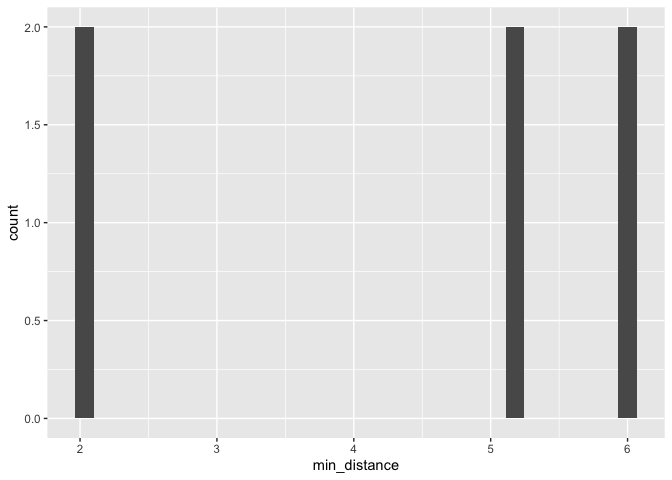
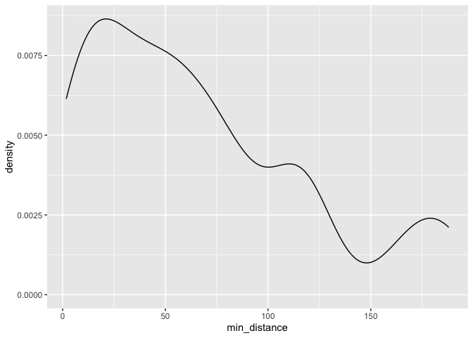
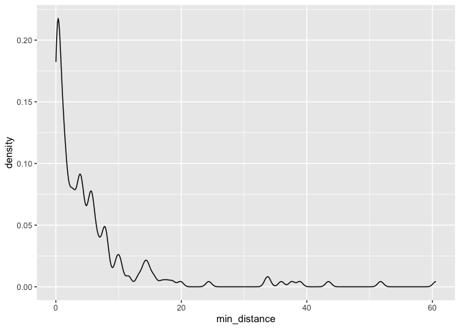
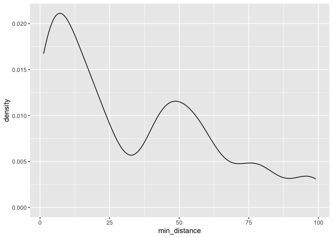

Lab 05 - La Quinta is Spanish for next to Denny’s, Pt. 2
================
Thomas Huang
2026-02-06

### Load packages and data

``` r
library(tidyverse) 
library(dsbox) 
```

``` r
states <- read_csv("data/states.csv")
data(dennys, package = "dsbox")
data(laquinta, package = "dsbox")
```

### Exercise 1

There are three Denny’s and two La Quinta in Alaska.

``` r
dn_ak <- dennys %>%
  filter(state == "AK")
nrow(dn_ak)
```

    ## [1] 3

``` r
lq_ak <- laquinta %>%
  filter(state == "AK")
nrow(lq_ak)
```

    ## [1] 2

### Exercise 2

There are three Denny’s and two La Quinta in Alaska. Each Denny’s
corresponds to two La Quinta. Therefore, there should be $$3\times2=6$$
pairs.

### Exercise 3

``` r
dn_lq_ak <- full_join(dn_ak, lq_ak,
  by = "state"
)
```

    ## Warning in full_join(dn_ak, lq_ak, by = "state"): Detected an unexpected many-to-many relationship between `x` and `y`.
    ## ℹ Row 1 of `x` matches multiple rows in `y`.
    ## ℹ Row 1 of `y` matches multiple rows in `x`.
    ## ℹ If a many-to-many relationship is expected, set `relationship =
    ##   "many-to-many"` to silence this warning.

``` r
dn_lq_ak
```

    ## # A tibble: 6 × 11
    ##   address.x     city.x state zip.x longitude.x latitude.x address.y city.y zip.y
    ##   <chr>         <chr>  <chr> <chr>       <dbl>      <dbl> <chr>     <chr>  <chr>
    ## 1 2900 Denali   Ancho… AK    99503       -150.       61.2 3501 Min… "\nAn… 99503
    ## 2 2900 Denali   Ancho… AK    99503       -150.       61.2 4920 Dal… "\nFa… 99709
    ## 3 3850 Debarr … Ancho… AK    99508       -150.       61.2 3501 Min… "\nAn… 99503
    ## 4 3850 Debarr … Ancho… AK    99508       -150.       61.2 4920 Dal… "\nFa… 99709
    ## 5 1929 Airport… Fairb… AK    99701       -148.       64.8 3501 Min… "\nAn… 99503
    ## 6 1929 Airport… Fairb… AK    99701       -148.       64.8 4920 Dal… "\nFa… 99709
    ## # ℹ 2 more variables: longitude.y <dbl>, latitude.y <dbl>

### Exercise 4

There are six observations in this data frame. The variable are street
address, city, state, zip code, longitude, and latitude of each Denny’s
and La Quinta.

``` r
glimpse(dn_lq_ak)
```

    ## Rows: 6
    ## Columns: 11
    ## $ address.x   <chr> "2900 Denali", "2900 Denali", "3850 Debarr Road", "3850 De…
    ## $ city.x      <chr> "Anchorage", "Anchorage", "Anchorage", "Anchorage", "Fairb…
    ## $ state       <chr> "AK", "AK", "AK", "AK", "AK", "AK"
    ## $ zip.x       <chr> "99503", "99503", "99508", "99508", "99701", "99701"
    ## $ longitude.x <dbl> -149.8767, -149.8767, -149.8090, -149.8090, -147.7600, -14…
    ## $ latitude.x  <dbl> 61.1953, 61.1953, 61.2097, 61.2097, 64.8366, 64.8366
    ## $ address.y   <chr> "3501 Minnesota Dr.", "4920 Dale Rd", "3501 Minnesota Dr."…
    ## $ city.y      <chr> "\nAnchorage", "\nFairbanks", "\nAnchorage", "\nFairbanks"…
    ## $ zip.y       <chr> "99503", "99709", "99503", "99709", "99503", "99709"
    ## $ longitude.y <dbl> -149.9119, -147.8660, -149.9119, -147.8660, -149.9119, -14…
    ## $ latitude.y  <dbl> 61.18843, 64.82426, 61.18843, 64.82426, 61.18843, 64.82426

### Exercise 5

dplyr::mutate(new_var = …) can be used to create a new variable.

``` r
# Define a cool function that calculates the distance between any two points on the earth.
haversine <- function(long1, lat1, long2, lat2, round = 3) {
  # convert to radians
  long1 <- long1 * pi / 180
  lat1 <- lat1 * pi / 180
  long2 <- long2 * pi / 180
  lat2 <- lat2 * pi / 180

  R <- 6371 # Earth mean radius in km

  a <- sin((lat2 - lat1) / 2)^2 + cos(lat1) * cos(lat2) * sin((long2 - long1) / 2)^2
  d <- R * 2 * asin(sqrt(a))

  return(round(d, round)) # distance in km
}
```

### Exercise 6

``` r
dn_lq_ak <- dn_lq_ak %>% 
  dplyr::mutate(
    distance = haversine(longitude.x, latitude.x, longitude.y, latitude.y)
  )

glimpse(dn_lq_ak)
```

    ## Rows: 6
    ## Columns: 12
    ## $ address.x   <chr> "2900 Denali", "2900 Denali", "3850 Debarr Road", "3850 De…
    ## $ city.x      <chr> "Anchorage", "Anchorage", "Anchorage", "Anchorage", "Fairb…
    ## $ state       <chr> "AK", "AK", "AK", "AK", "AK", "AK"
    ## $ zip.x       <chr> "99503", "99503", "99508", "99508", "99701", "99701"
    ## $ longitude.x <dbl> -149.8767, -149.8767, -149.8090, -149.8090, -147.7600, -14…
    ## $ latitude.x  <dbl> 61.1953, 61.1953, 61.2097, 61.2097, 64.8366, 64.8366
    ## $ address.y   <chr> "3501 Minnesota Dr.", "4920 Dale Rd", "3501 Minnesota Dr."…
    ## $ city.y      <chr> "\nAnchorage", "\nFairbanks", "\nAnchorage", "\nFairbanks"…
    ## $ zip.y       <chr> "99503", "99709", "99503", "99709", "99503", "99709"
    ## $ longitude.y <dbl> -149.9119, -147.8660, -149.9119, -147.8660, -149.9119, -14…
    ## $ latitude.y  <dbl> 61.18843, 64.82426, 61.18843, 64.82426, 61.18843, 64.82426
    ## $ distance    <dbl> 2.035, 416.031, 5.998, 413.653, 419.879, 5.197

### Exercise 7

``` r
dn_lq_ak <- dn_lq_ak %>% 
  group_by(address.x) %>% 
  mutate(min_distance = min(distance))
```

### Exercise 8

``` r
# Summary stats
psych::describe(dn_lq_ak$min_distance)
```

    ##    vars n mean   sd median trimmed  mad  min max range  skew kurtosis   se
    ## X1    1 6 4.41 1.87    5.2    4.41 1.19 2.04   6  3.96 -0.45    -1.96 0.77

``` r
ggplot(data = dn_lq_ak, aes(x = min_distance)) +
  geom_histogram()
```

    ## `stat_bin()` using `bins = 30`. Pick better value `binwidth`.

<!-- -->

### Exercise 9

``` r
state_function <- function(state_abbr){
  dn_state <- dennys %>%
  filter(state == state_abbr)

  lq_state <- laquinta %>%
  filter(state == state_abbr)
  
  dn_lq_state <- full_join(dn_state, lq_state,
    by = "state"
  ) %>% 
    dplyr::mutate(
      distance = haversine(longitude.x, latitude.x, longitude.y, latitude.y)
    ) %>% 
    group_by(address.x) %>% 
    mutate(min_distance = min(distance))
  
  psych::describe(dn_lq_state$min_distance)
  ggplot(data = dn_lq_state, aes(x = min_distance)) +
    geom_density()
}
```

``` r
state_function("NC")
```

    ## Warning in full_join(dn_state, lq_state, by = "state"): Detected an unexpected many-to-many relationship between `x` and `y`.
    ## ℹ Row 1 of `x` matches multiple rows in `y`.
    ## ℹ Row 1 of `y` matches multiple rows in `x`.
    ## ℹ If a many-to-many relationship is expected, set `relationship =
    ##   "many-to-many"` to silence this warning.

<!-- -->

### Exercise 10

``` r
state_function("TX")
```

    ## Warning in full_join(dn_state, lq_state, by = "state"): Detected an unexpected many-to-many relationship between `x` and `y`.
    ## ℹ Row 1 of `x` matches multiple rows in `y`.
    ## ℹ Row 1 of `y` matches multiple rows in `x`.
    ## ℹ If a many-to-many relationship is expected, set `relationship =
    ##   "many-to-many"` to silence this warning.

<!-- -->

### Exercise 11

I chose New York for this exercise.

``` r
state_function("NY")
```

    ## Warning in full_join(dn_state, lq_state, by = "state"): Detected an unexpected many-to-many relationship between `x` and `y`.
    ## ℹ Row 1 of `x` matches multiple rows in `y`.
    ## ℹ Row 1 of `y` matches multiple rows in `x`.
    ## ℹ If a many-to-many relationship is expected, set `relationship =
    ##   "many-to-many"` to silence this warning.

<!-- -->

### Exercise 12

I think the joke is mostly true. It’s easy to find a La Quinta close to
a Denny’s.
